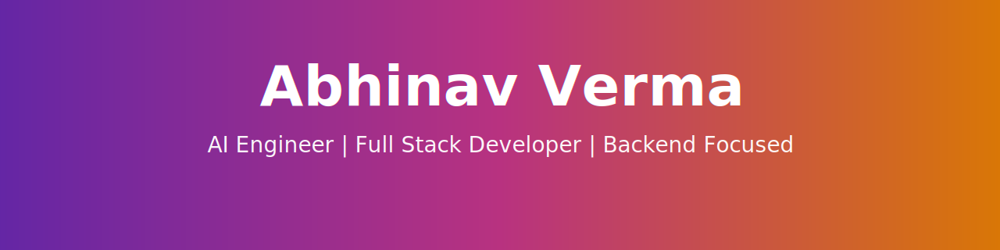

  

# Hi 👋 I'm Abhinav Verma

### Full Stack Web Developer • MERN Stack Developer • JavaScript Enthusiast

I'm a passionate developer who enjoys building modern web applications, exploring AI-powered workflows, and continuously learning new technologies. My goal is to create software that is fast, scalable, and solves real-world problems.

---

# 🚀 About Me

- 💻 Full Stack Web Developer
- 🌱 Currently learning advanced backend development and deployment
- 🤖 Exploring AI agents, automation, and developer productivity
- ⚡ Love building practical projects using modern technologies
- 🎯 Always improving my coding skills through real-world projects

---

# 🛠 Tech Stack

### Languages

### Frontend

### Backend

### Database

### Tools

---

# 📊 GitHub Stats

---

# 🎯 Current Focus

- 🚀 Building Full Stack Web Applications
- 🤖 Learning AI Agent Workflows
- ☁️ Cloud Deployment
- 📱 Responsive UI Development
- ⚙️ Backend APIs

---

# 🌱 Currently Learning

- Advanced React
- TypeScript
- System Design
- Authentication
- Docker
- CI/CD

---

# 🎯 Goals

- Build production-ready applications
- Contribute to Open Source
- Master Full Stack Development
- Create AI-powered products
- Keep learning every day

---

# 📌 Featured Projects

- 🌐 Full Stack Web Applications
- 🤖 AI-powered Projects
- 📱 Responsive Websites
- ⚡ REST APIs
- 🛠 Developer Tools

---

# 📫 Connect With Me

- GitHub: https://github.com/abhinavverma4372-beep
- Email: your-email@example.com

---

⭐ Thanks for visiting my profile!

